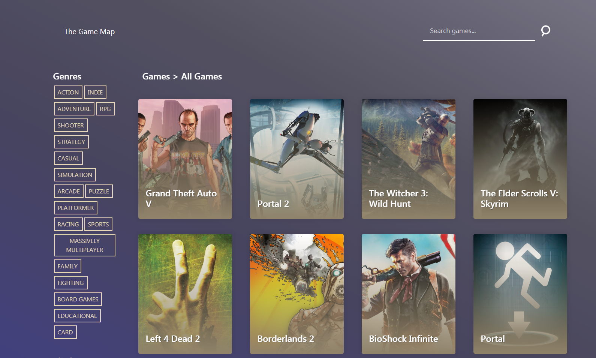

# The Games Map Web
A dynamic generated web that takes games data from an API and shows the info to the user with a beautiful design

#### Technologies:
      - HTML5
      - CSS3
      - Javascript
      - Bootstrap
#### Features:
      - Responsive
      - Dynamic generated content
      - Fetching data from an API using AJAX and the Fetch API
      - Clean modern design
      - Single page web
      - Search and filter content

#### [Youtube video showing its functionality](http://)

The Games Map was a **collaborative** class project along two other classmates. Our vision was to create a simple to use and atractive website where anyone could **explore and find** new video games.

We decided to use a public **API** provided by [rawg.io](https://rawg.io/).  This API had everything we needed: game titles, release platforms, cover images and descriptions for most games. Also allowed us to search games from text, and filter by genre, platform and developer.

The final result was an **easy to use**, **intuitive**, **single-page** **repsonsive** web. You can filter games by different categories just by clicking them and do custom game searches. By passing the mouse over the game covers some extra information is provided, including a rating. If the game is clicked a modal window is opened with all the details of the game, including captures and a game-play video.

